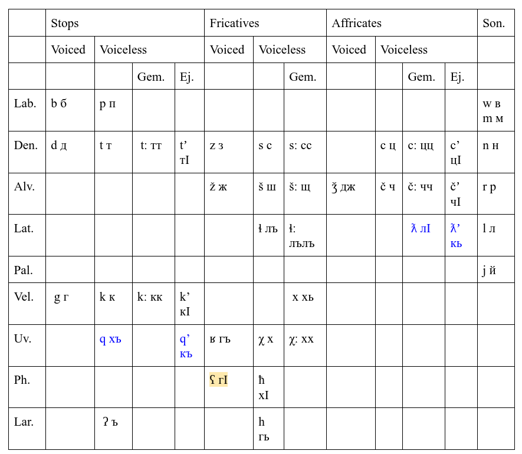
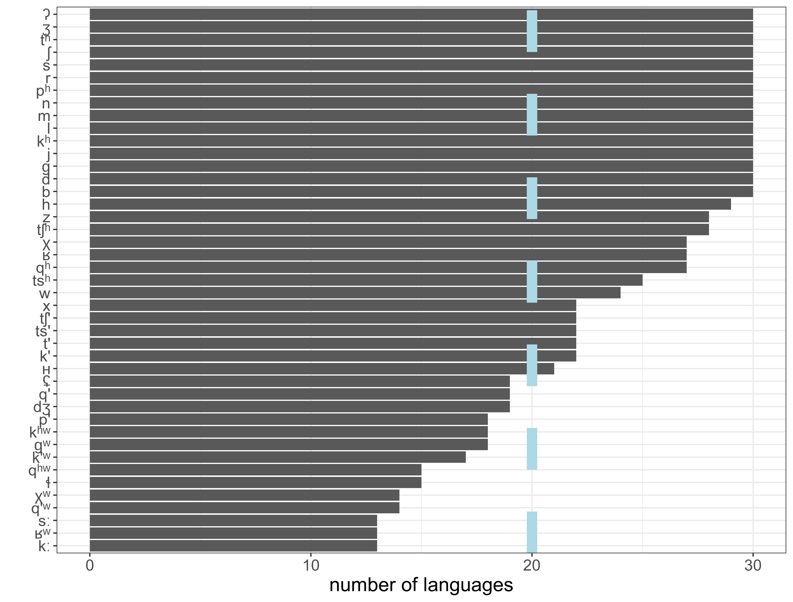
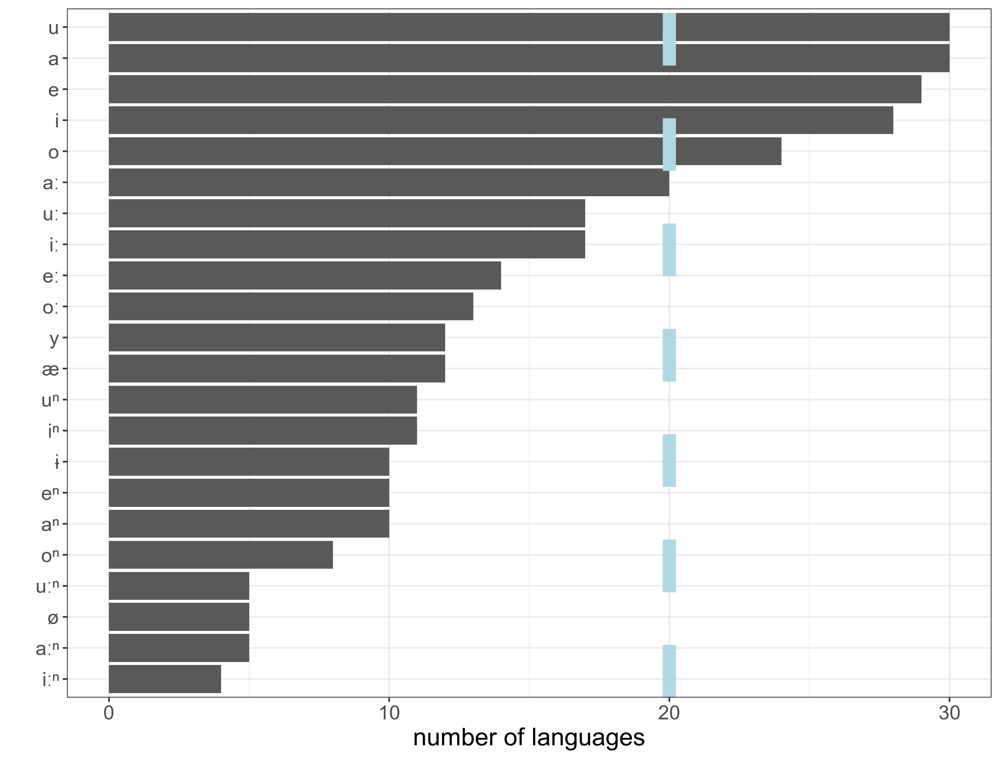

```{r setup, include=FALSE}
options(digits = 3)
knitr::opts_chunk$set(echo = FALSE, warning = FALSE, message = FALSE)
# library(qrcode)
# png(filename="images/00_qrcode.png", width = 200, height = 200)
# qrcode_gen("https://github.com/agricolamz/2020.10.21_HSE_Phonology_of_East_Caucasian_languages/raw/master/2020.10.21_HSE_Phonology_of_East_Caucasian_languages.pdf")
# dev.off()
library(tidyverse)
theme_set(theme_bw())
library(lingtypology)
library(phonfieldwork)
data <- read_csv("data/data.csv")
data %>% 
  distinct(glottocode, branch) %>%
  mutate(lang = lang.gltc(glottocode),
         lat = lat.lang(lang),
         long = long.lang(lang)) ->
  data_m

data_m[data_m$lang == "Megeb", 4] <- 42.2528
data_m[data_m$lang == "Megeb", 5] <- 47.0472

data_m[data_m$lang == "Avar", 4] <- 42.74667
data_m[data_m$lang == "Avar", 5] <- 46.65917

data_m[data_m$lang == "Chechen", 4] <- 43.04028
data_m[data_m$lang == "Chechen", 5] <- 45.73028

data_m[data_m$lang == "Ingush", 4] <- 43.026712
data_m[data_m$lang == "Ingush", 5] <- 44.994647

data_m[data_m$lang == "Udi", 4] <- 41.15083
data_m[data_m$lang == "Udi", 5] <- 47.45833

data_m[data_m$lang == "Tsakhur", 4] <- 41.15083
data_m[data_m$lang == "Tsakhur", 5] <- 47.45833
```

# Introduction

## About phonology of East Caucasian languages

* phonology
    * [@kk90]
    * The indigenous languages of the Caucasus: [@smeets94a], [@smeets94b]
    * Yaziki mira: [@alekseev01] and predecessor projects
    * [@grawunder17]
    * The Oxford Handbook of Languages of the
Caucasus: [@begus21], [@boris21b], [@boris21a]
    * Handbook of Caucasian
Languages: [@koryakov21]
    * and phonological part in more general descriptions of East Caucasian languages
* historical-comparative phonetics
    * S. M. Gasanova, G. Kh. Ibragimov, P. T. Magomedova, U. A. Meylanova, B. B. Talibov, S. M. Khaydakov, A. E. Alekseev, Ju. D. Desheriev, B. K. Gigineishvili, D. S. Imnaishvili, J. Nichols, S. L. Nikolayev, S. A. Starostin, A. S. Kasyan, N. A. Ardoteli, O. A. Mudrak

# Data

## Languages
\begin{multicols}{3}
\begin{itemize}

\item Nakh
\begin{itemize}
  \item Chechen
  \item Ingush
  \item Tsova-Tush (Bats, Batsbi)
\end{itemize}
\item Tsezic (Didoic)
\begin{itemize}
\item Tsez
\item Hinuq
\item Bezhta
\item Hunzib
\item Khwarshi-Inkhoqwari
\end{itemize}
\item Avar–Andic
\begin{itemize}
  \item Avar
  \item Andi
  \item Botlikh
  \item Godoberi
  \item Chamalal
  \item Karata
  \item Tindi
  \item Bagvalal
  \item Akhvakh
\end{itemize}
\item Dargwa
\item Lak
\item Lezgic
\begin{itemize}
\item Archi
\item Tabasaran
\item Aghul
\item Lezgian
\item Udi
\item Budukh
\item Kryz
\item Rutul
\item Tsakhur
\end{itemize}
\item Khinalug
\end{itemize}
\end{multicols}


## Languages not present in [@kk90]

\begin{multicols}{3}
\begin{itemize}
\item \alert{Nakh}
\begin{itemize}
  \item \alert{Chechen}
  \item \alert{Ingush}
  \item \alert{Tsova-Tush (Bats, Batsbi)}
\end{itemize}
\item Tsezic (Didoic)
\begin{itemize}
\item Tsez
\item Hinuq
\item Bezhta
\item Hunzib
\item Khwarshi-Inkhoqwari
\end{itemize}
\item Avar–Andic
\begin{itemize}
  \item Avar
  \item Andi
  \item \alert{Botlikh}
  \item \alert{Godoberi}
  \item \alert{Karata}
  \item Chamalal
  \item Tindi
  \item \alert{Bagvalal}
  \item Akhvakh
\end{itemize}
\item Dargwa
\item Lak
\item Lezgic
\begin{itemize}
\item Archi
\item Tabasaran
\item Aghul
\item Lezgian
\item Udi
\item Budukh
\item Kryz
\item Rutul
\item Tsakhur
\end{itemize}
\item Khinalug
\end{itemize}
\end{multicols}

## Languages not present in [@kk90]

* Andic, Bagvalal [@kibrik01]
* Andic, Botlikh [@alexeyev21]
* Andic, Godoberi [@moroz21]
* Andic, Karata [@magomedbekova71]
* Dargwa, Mehweb [@moroz19]
* Nakh, Chechen [@nichols94a]
* Nakh, Ingush [@nichols94b]
* Nakh, Tsova-Tush [@holisky94]

## Data

`r nrow(data)` $\times$ `r ncol(data)` [table](https://raw.githubusercontent.com/agricolamz/2020.10.21_HSE_Phonology_of_East_Caucasian_languages/master/data/data.csv) with the following columns:

```{r, results="asis"}
cat(paste0("* ", colnames(data), "\n"))
```


## Data (language view)

```{r}
map.feature(lang = data_m$lang,
            features = data_m$branch, 
            latitude = data_m$lat,
            longitude = data_m$long,
            width = 7,
            tile = "Stamen.Terrain",
            minimap = TRUE, 
            minimap.position = "bottomleft",
            minimap.width = 300)
```


## Data (village view)

```{r, cache = TRUE}
all_villages <- read_tsv("https://raw.githubusercontent.com/sverhees/master_villages/master/data/villages.csv")

all_villages %>% 
  filter(!kutans,
         !is.na(lat),
         !str_detect(lang, "Tat|Kumyk|Nogai|Azerbaijani|Georgian")) ->
  all_villages

all_villages %>% 
  filter(str_detect(lang, "Agul|Akhvakh|Andi|Archi|Avar|Bagvalal|Bats|Bezhta|Botlikh|Budukh|Chamalal|Chechen|Dargwa|Godoberi|Hinuq")) ->
  first_map

all_villages %>% 
  filter(str_detect(lang, "Hunzib|Ingush|Khwarshi|Karata|Khinalug|Kryz|Lak|Lezgian|Rutul|Tabasaran|Tindi|Tsakhur|Tsez|Udi")) ->
  second_map

set.seed(45)
my_colors <-
    c(
      "#1f77b4",
      "#ff7f0e",
      "#2ca02c",
      "#d62728",
      "#9467bd",
      "#8c564b",
      "#e377c2",
      "#7f7f7f",
      "#17becf",
      sample(grDevices::colors()[!grepl("ivory|azure|white|gray|grey|black|pink|1",
                                        grDevices::colors())])
    )

map.feature(lang = first_map$lang,
            features = first_map$lang, 
            latitude = first_map$lat,
            longitude = first_map$lon,
            color = my_colors[1:15],
            width = 3,
            tile = "Stamen.Terrain") %>% 
  map.feature(lang = second_map$lang,
            features = second_map$lang, 
            latitude = second_map$lat,
            longitude = second_map$lon,
            color = my_colors[16:29],
            width = 3,
            tile = "Stamen.Terrain", 
            pipe.data = ., legend.position = "topleft",
            minimap = TRUE, 
            minimap.position = "bottomleft",
            minimap.width = 300)
```

# Methods

## Phonology of East Caucasian languages can be preseneted like this...

```{r}

```

## Phonology of East Caucasian languages can be preseneted like this...

```{r}
knitr::include_graphics("images/02_systems.png")
```

## Phonology of East Caucasian languages can be preseneted like this...

```{r}

```

## This way is...

* boring, \pause
* mechanical, \pause 
* it is hard to make generalisations (at least, on the fly)

## Phonology of East Caucasian languages can be preseneted like this...
      


\pause

(If you have not seen it, go and wath [our previous lecture](https://youtu.be/gfvauHnP1c4)!)

## These ways are...

* To list all inventories
    * boring, 
    * mechanical, 
    * hard to make generalisations (at least, on the fly)
* To present generalisations
    * restricted to peculiarities, \pause
    * you need to be a specialist \pause
* May be these conclusions could be data driven? \pause
    * some of them can be visualised with a map
    * some of them can be gahtered via frequency and combinatorics analysis

# Inventory size

## Consonants

```{r}
data %>% 
  left_join(data_m) %>% 
  count(language, lang, lat, long, sound_type, branch) %>% 
  pivot_wider(names_from = sound_type, values_from = n, values_fill = 0) %>% 
  mutate(`vo+di` = vowel+diphthong) ->
  raw_counts

map.feature(languages = raw_counts$lang,
            latitude = raw_counts$lat,
            longitude = raw_counts$long,
            minichart = "pie",
            minichart.data = raw_counts$consonant,
            minichart.labels = TRUE,
            width = 3,
            tile = "Stamen.Terrain")
```

Languages ranges from 33 to 91 consonants.

## Consonants

```{r}
raw_counts %>% 
  ggplot(aes(consonant))+
  geom_histogram()+
  theme(text = element_text(size = 16))+
  labs(x = "consonant invetory size", y = "number of languages")
```

Most of the languages have 42\pm 5 consonants.

## Consonants

```{r}
map.feature(languages = raw_counts$lang,
            features = raw_counts$consonant,
            latitude = raw_counts$lat,
            longitude = raw_counts$long,
            width = 7,
            tile = "Stamen.Terrain")
```

Most of the huge systems are presented in Andic and grouped together.

## Consonants

* Akhwakh (Andic) -- 91
* Tindi (Andic) -- 84
* Chamalal (Andic) -- 73
* Archi (Lezgic) -- 78
* ...
* Ingush (Nakh) -- 34
* Bezhta (Tsezic) -- 34
* Inkhoqwari (Tsezic) -- 33

* ejectives
* gemenation (fortis)
* labialization

## Consonants: Akwakh vs. Inkhoqwari
\small
\begin{tabular}{|c|c|c|c|c|c|c|c|c|c|c|c|c|c|}
\hline
b  & d   &      &       & dʒ   &       &      &       & ɡ   &      &     &      &   &    \\ \hline
   & dʷ  &      &       & dʒʷ  &       &      &       & ɡʷ  &      &     &      &   &    \\ \hline
pʰ & tʰ  & ts   & tsː   & tʃ   & tʃː   & tɬ   & tɬː   & k   & kː   & q   & qː   &   & ʔ  \\ \hline
   & tʰʷ & tsʷ  & tsːʷ  & tʃʷ  & tʃːʷ  & tɬʷ  & tɬːʷ  & kʷ  & kːʷ  & qʷ  & qːʷ  &   & ʔʷ \\ \hline
p’ & t’  & ts’  & tsː’  & tʃ’  & tʃ’ː  & tɬ’  & tɬ’ː  & k’  & k’ː  & q’  & q’ː  &   &    \\ \hline
   & t’ʷ & ts’ʷ & tsː’ʷ & tʃ’ʷ & tʃ’ːʷ & tɬ’ʷ & tɬ’ːʷ & k’ʷ & k’ːʷ & q’ʷ & q’ːʷ &   &    \\ \hline
   &     & z    &       & ʒ    &       &      &       &     &      & ʁ   &      & ʢ &    \\ \hline
   &     & zʷ   &       & ʒʷ   &       &      &       &     &      & ʁʷ  &      &   &    \\ \hline
   &     & s    & sː    & ʃ    & ʃː    & ɬ    & ɬː    & x   & xː   & χ   & χː   & ʜ & h  \\ \hline
   &     & sʷ   & sːʷ   & ʃʷ   & ʃːʷ   & ɬʷ   & ɬːʷ   & xʷ  & xːʷ  & χʷ  & χːʷ  &   & hʷ \\ \hline
m  & n   &      &       &      &       &      &       &     &      &     &      &   &    \\ \hline
w  & r   &      &       &      &       & l    &       & j   &      &     &      &   &    \\ \hline
\end{tabular}

\begin{tabular}{|c|c|c|c|c|c|c|c|c|}
\hline
b  & d  &     & dʒ  &     & ɡ  &    &   &   \\ \hline
pʰ & tʰ & ts  & tʃ  & tɬ  & k  & q  &   & ʔ \\ \hline
p’ & t’ & ts’ & tʃ’ & tɬ’ & k’ & q’ &   &   \\ \hline
   &    & z   & ʒ   &     &    & ʁ  & ʢ &   \\ \hline
   &    & s   & ʃ   & ɬ   &    & χ  & ʜ & h \\ \hline
m  & n  &     &     &     &    &    &   &   \\ \hline
w  & r  &     &     & l   & j  &    &   &   \\ \hline
\end{tabular}

## Gemination and ejectives (example from Zilo Andi)

```{r, eval = FALSE}
draw_sound(file_name = "data/k.wav",
           annotation = "data/k.TextGrid", 
           text_size = 2.2,
           spectrum_info = FALSE,
           output_file = "images/12_gemination_example")
```


* Geminated aspirated have longer closure. 
* Geminated ejectives have longer burst. 

## Laterals (example from Zilo Andi)
```{r, eval = FALSE}
draw_sound(file_name = "data/lateral.wav",
           annotation = "data/lateral.TextGrid", 
           text_size = 2.2,
           spectrum_info = FALSE,
           output_file = "images/13_lateral_example")
```


Looks like it is not tɬ' but tɬ'ː in Andic...

## Geminate consonants
```{r}
data %>% 
  filter(sound_type == "consonant") %>% 
  left_join(data_m) %>%
  mutate(feature = str_detect(segments_IPA, "ː")) %>%
  group_by(language, branch, lang, lat, long) %>% 
  summarise(feature = sum(feature)) %>% 
  mutate(feature = ifelse(feature > 0, "present", "absent")) ->
  for_map

map.feature(languages = for_map$lang,
            features = for_map$branch,
            stroke.features = for_map$feature,
            latitude = for_map$lat,
            longitude = for_map$long,
            width = 6,
            tile = "Stamen.Terrain")
```
Geminate consonants are absent in Tsezic and most Lezgic.

## Labialised consonants
```{r}
data %>% 
  filter(sound_type == "consonant") %>% 
  left_join(data_m) %>%
  mutate(feature = str_detect(segments_IPA, "ʷ")) %>%
  group_by(language, branch, lang, lat, long) %>% 
  summarise(feature = sum(feature)) %>% 
  mutate(feature = ifelse(feature > 0, "present", "absent")) ->
  for_map

map.feature(languages = for_map$lang,
            features = for_map$branch,
            stroke.features = for_map$feature,
            latitude = for_map$lat,
            longitude = for_map$long,
            width = 6,
            tile = "Stamen.Terrain")
```
Labialised consonants are absent in Nakh, but more or less common through other branches.

## Lateral consonants
```{r}
data %>% 
  filter(sound_type == "consonant") %>% 
  left_join(data_m) %>%
  mutate(feature = str_detect(segments_IPA, "ɬ")) %>%
  group_by(language, branch, lang, lat, long) %>% 
  summarise(feature = sum(feature)) %>% 
  mutate(feature = ifelse(feature > 0, "present", "absent")) ->
  for_map

map.feature(languages = for_map$lang,
            features = for_map$branch,
            stroke.features = for_map$feature,
            latitude = for_map$lat,
            longitude = for_map$long,
            width = 6,
            tile = "Stamen.Terrain")
```
It is looks like an areal pattern: all Avar-Andic and Tsezic, but also Tsova-Tush and Archi.

## Vowels

```{r}
map.feature(languages = raw_counts$lang,
            latitude = raw_counts$lat,
            longitude = raw_counts$long,
            minichart = "pie",
            minichart.data = raw_counts$vowel,
            minichart.labels = TRUE,
            width = 3,
            tile = "Stamen.Terrain")
```

Languages ranges from 5 to 21 vowels.


## Vowels
```{r}
raw_counts %>% 
  ggplot(aes(vowel))+
  geom_histogram()+
  theme(text = element_text(size = 16))+
  labs(x = "vowel invetory size", y = "number of languages")
```
Most of the languages have 10±5 vowels.

## Vowels

* Bezhta (Tsezic) --	21
* Akhvakh (Andic)	-- 20
* Hunzib (Tsezic) -- 20
* Bagvalal (Andic) -- 20
* ...
* Aghul (Lezgic) -- 6
* Tsez (Tsezic) -- 6
* Avar -- 5

## Vowels

* Bezhta

\begin{tabular}{|c|c|c|c|c|c|c|c|c|c|c|}
\hline
i & i: & iⁿ & y & yⁿ &   &    &    & u & uː & uⁿ \\ \hline
e &    & eⁿ & ø &    &   &    &    & o & oː & oⁿ \\ \hline
æ & æː & æⁿ &   &    &   &    &    &   &    &    \\ \hline
  &    &    &   &    & a & aː & aⁿ &   &    &    \\ \hline
\end{tabular}

* Avar

\begin{tabular}{|c|c|c|}
\hline
i &   & u \\ \hline
e &   & o \\ \hline
  & a &   \\ \hline
\end{tabular}

## Vowels

```{r}
map.feature(languages = raw_counts$lang,
            features = raw_counts$vowel,
            latitude = raw_counts$lat,
            longitude = raw_counts$long,
            width = 7,
            tile = "Stamen.Terrain")
```
Most of the huge systems are presented in Tsezic and Andic.

## Nasal vowels

```{r}
data %>% 
  left_join(data_m) %>% 
  mutate(feature = str_detect(segments_IPA, "ⁿ")) %>%
  group_by(language, branch, lang, lat, long) %>% 
  summarise(feature = sum(feature)) %>% 
  mutate(feature = ifelse(feature > 0, "present", "absent")) ->
  for_map

map.feature(languages = for_map$lang,
            features = for_map$branch,
            stroke.features = for_map$feature,
            latitude = for_map$lat,
            longitude = for_map$long,
            width = 6,
            tile = "Stamen.Terrain")
```

From Andic and Tsezic only Avar, Hinuq, and Tsez lack nasalized vowels.

## Long vowels

```{r}
data %>% 
  left_join(data_m) %>% 
  filter(sound_type == "vowel") %>% 
  mutate(feature = str_detect(segments_IPA, "ː")) %>%
  group_by(language, branch, lang, lat, long) %>% 
  summarise(feature = sum(feature)) %>% 
  mutate(feature = ifelse(feature > 0, "present", "absent")) ->
  for_map

map.feature(languages = for_map$lang,
            features = for_map$branch,
            stroke.features = for_map$feature,
            latitude = for_map$lat,
            longitude = for_map$long,
            width = 6,
            tile = "Stamen.Terrain")
```
Long vowels are common to all branches.

## Diphthongs

```{r}
data %>% 
  left_join(data_m) %>%
  mutate(feature = str_detect(sound_type, "diphthong")) %>%
  group_by(language, branch, lang, lat, long) %>% 
  summarise(feature = sum(feature)) %>% 
  mutate(feature = ifelse(feature > 0, "present", "absent")) ->
  for_map

map.feature(languages = for_map$lang,
            features = for_map$branch,
            stroke.features = for_map$feature,
            latitude = for_map$lat,
            longitude = for_map$long,
            width = 6,
            tile = "Stamen.Terrain")
```

Diphtongs are present only in Nakh.

# Frequency analysis

## Segments present in all languages

```{r, eval=FALSE}
data %>% 
  count(segments_IPA) %>% 
  filter(n == 30)
```


\begin{tabular}{|c|c|c|c|c|c|c|c|}
\hline
b  & d  &   &   &   &   & ɡ &   \\ \hline
pʰ & tʰ &   &   &   &   & kʰ& ʔ \\ \hline
   &    &   & ʒ &   &   &   &   \\ \hline
   &    & s & ʃ &   &   &   & h \\ \hline
m  & n  &   &   &   &   &   &   \\ \hline
   & r  &   &   & l & j &   &   \\ \hline
\end{tabular}

* Where are the famouse ejectives? \pause Udiː

\begin{tabular}{|c|c|c|c|c|c|c|c|c|}
\hline
b  & d  & dz  & dʒ  &   &   & ɡ  &    &   \\ \hline
pʰ & tʰ & tsʰ & tʃʰ &   &   & kʰ & qʰ &   \\ \hline
p  & t  & ts  & tʃ  &   &   & k  & q  & ʔ \\ \hline
v  &    & z   & ʒ   &   &   &    & ʁ  &   \\ \hline
f  &    & s   & ʃ   &   &   &    & χ  & h \\ \hline
m  & n  &     &     &   &   &    &    &   \\ \hline
w  & r  &     &     & l & j &    &    &   \\ \hline
\end{tabular}

## Consonants: typical inventory

```{r, eval=FALSE}
data %>% 
  filter(sound_type == "consonant") %>% 
  count(segments_IPA, sort = TRUE) %>% 
  filter(n > 12) %>% 
  mutate(segments_IPA = fct_reorder(segments_IPA, n)) %>% 
  ggplot(aes(n, segments_IPA))+
  geom_col()+
  theme(text = element_text(size = 16))+
  labs(x = "number of languages", y = "")
ggsave("images/05_cons.png")
```


## Consonants: typical inventory

```{r, eval=FALSE}
data %>% 
  filter(sound_type == "consonant") %>% 
  count(segments_IPA, sort = TRUE) %>% 
  filter(n > 12) %>% 
  mutate(segments_IPA = fct_reorder(segments_IPA, n)) %>% 
  ggplot(aes(n, segments_IPA))+
  geom_col()+
  theme(text = element_text(size = 16))+
  labs(x = "number of languages", y = "")+
  geom_vline(xintercept = 20, color = "lightblue", size = 4, linetype = 2)
ggsave("images/06_cons_line.png")
```



## Consonants: typical inventory

\begin{tabular}{|c|c|c|c|c|c|c|c|c|c|}
\hline
b  & d  &     &     &   &   & ɡ  &    &   &   \\ \hline
pʰ & tʰ & ts  & tʃʰ &   &   & kʰ & qʰ &   & ʔ \\ \hline
p’ & t’ & ts’ & tʃ’ &   &   & k’ & q’ &   &   \\ \hline
   &    & z   & ʒ   &   &   &    & ʁ  & ʢ &   \\ \hline
w  &    & s   & ʃ   &   &   & x  & χ  & ʜ & h \\ \hline
m  & n  &     &     &   &   &    &    &   &   \\ \hline
   & r  &     &     & l & j &    &    &   &   \\ \hline
\end{tabular}

For more consonants:

* labialisation
* gemination
* laterals
* pharyngealisation

## Vowels: typical inventory

```{r, eval=FALSE}
data %>% 
  filter(sound_type == "vowel") %>% 
  count(segments_IPA, sort = TRUE) %>% 
  filter(n > 3) %>% 
  mutate(segments_IPA = fct_reorder(segments_IPA, n)) %>% 
  ggplot(aes(n, segments_IPA))+
  geom_col()+
  theme(text = element_text(size = 16))+
  labs(x = "number of languages", y = "")+
  geom_vline(xintercept = 15, color = "lightblue", size = 4, linetype = 2)
ggsave("images/07_vowels_line.png")
```



## Vowels: typical inventory

\begin{tabular}{|c|c|c|c|c|c|}
\hline
i & iː &   &    & u & uː \\ \hline
e &    &   &    & o &    \\ \hline
  &    & a & aː &   &    \\ \hline
\end{tabular}

For more vowels:

* length
* nasalizsation
* pharyngealization

# Compare to other databases

## PHOIBLE [@phoible]: consonants

```{r, eval = FALSE}
library(lingtypology)
df <- phoible.feature()
df %>% 
  filter(source == "gm",
         segmentclass == "consonant") %>% 
  count(phoneme, sort = TRUE) %>% 
  mutate(phoneme = fct_reorder(phoneme, n)) %>% 
  filter(n> 60) %>% 
  ggplot(aes(n, phoneme))+
  geom_col()+
  theme(text = element_text(size = 16))+
  labs(x = "number of languages", y = "")+
  geom_vline(xintercept = 200, color = "lightblue", size = 4, linetype = 2)
ggsave("images/08_cons_phoible.png")
```


## PHOIBLE [@phoible]: consonants

\begin{tabular}{|c|c|c|c|c|c|c|c|}
\hline
b & d &   & dʒ &   &   & ɡ &   \\ \hline
p & t &   & tʃ &   &   & k &   \\ \hline
  &   & z & ʃ  &   &   &   &   \\ \hline
f &   & s &    &   &   &   & h \\ \hline
m & n &   &    &   & ɲ & ŋ &   \\ \hline
w & r &   &    & l & j &   &   \\ \hline
\end{tabular}

## PHOIBLE [@phoible]: vowels

```{r, eval = FALSE}
df %>% 
  filter(source == "gm",
         segmentclass == "vowel") %>% 
  count(phoneme, sort = TRUE) %>% 
  mutate(phoneme = fct_reorder(phoneme, n)) %>% 
  filter(n> 60) %>% 
  ggplot(aes(n, phoneme))+
  geom_col()+
  theme(text = element_text(size = 16))+
  labs(x = "number of languages", y = "")+
  geom_vline(xintercept = 200, color = "lightblue", size = 4, linetype = 2)+
  geom_vline(xintercept = 300, color = "lightblue", size = 4, linetype = 2)
ggsave("images/09_vowel_phoible.png")
```


## Eurasian phonological inventories [@eurasianphonology]: consonants

```{r, eval = FALSE}
js <- jsonlite::read_json("https://github.com/macleginn/eurasian-phonologies/blob/master/src/dbase/phono_dbase.json?raw=true")
js %>% 
  map("cons") %>% 
  unlist() ->
  cons

tibble(cons = cons, 
       source = names(cons)) %>% 
  mutate(source = str_remove_all(source, "\\#.*")) %>% 
  count(cons, sort = TRUE) %>% 
  filter(n> 60) %>% 
  mutate(cons = fct_reorder(cons, n)) %>% 
  ggplot(aes(n, cons))+
  geom_col()+
  theme(text = element_text(size = 16))+
  labs(x = "number of languages", y = "")+
  geom_vline(xintercept = 150, color = "lightblue", size = 4, linetype = 2)
ggsave("images/10_eurasianphonology_cons.png")
```


## Eurasian phonological inventories [@eurasianphonology]: consonants

\begin{tabular}{|c|c|c|c|c|c|c|c|}
\hline
b  & d  &    & dʒ &   &   & ɡ  &   \\ \hline
p  & t  & ts & tʃ &   &   & k  &   \\ \hline
pʰ & tʰ &    &    &   &   & kʰ &   \\ \hline
   &    & z  & ʒ  &   &   &    &   \\ \hline
f  & v  & s  & ʃ  &   &   & x  & h \\ \hline
m  & n  &    &    &   & ɲ & ŋ  &   \\ \hline
w  & r  &    &    & l & j &    &   \\ \hline
\end{tabular}

## Eurasian phonological inventories [@eurasianphonology]: vowels

```{r, eval = FALSE}
js %>% 
  map("vows") %>% 
  unlist() ->
  vows

tibble(vows = vows, 
       source = names(vows)) %>% 
  mutate(source = str_remove_all(source, "\\#.*")) %>% 
  count(vows, sort = TRUE) %>% 
  filter(n> 60) %>% 
  mutate(vows = fct_reorder(vows, n)) %>% 
  ggplot(aes(n, vows))+
  geom_col()+
  theme(text = element_text(size = 16))+
  labs(x = "number of languages", y = "")+
  geom_vline(xintercept = 150, color = "lightblue", size = 4, linetype = 2)
ggsave("images/11_eurasianphonology_vows.png")
```


## Conclusions

* East Caucasian consonant systems are more or less typical \pause
    * except uvular and laryngeal consonants
    * except ejective consonants
    * except laterals in Avar-Andic branch
    * except labialisation
    * except gemination \pause
* East Caucasian vowel systems are typical

# Suprasegmental features

## Syllable structure and suprasegmental features

Syllable structure CVCC, sometimes CVL (L -- sonorant or *b*).

A lot of East Caucasian languages has stress:

* some languages has more o less fixed stress (e. g. Mehweb)
* some languages has a tendency to have stress on first three syllables (Andic languages)
* a lot of languages distinguish morphological meanings via stress (e. g. plural marker in Dargic languages)

pharyngealization -- mystirius feature (absent in Andic branch).

\begin{table}[]
\begin{tabular}{lll}
d-irʔ-an                &  & d-irʡ-aˤn /d-irʔˤ-an/   \\
\textsc{npl}-gather:\textsc{ipfv-hab}     &  & \textsc{npl}-gather:\textsc{ipfv-hab}     \\
‘gathers them’          &  & ‘gathers them’          \\
                        &  &                         \\
ħa-d-irʔ-an             &  & ʜaˤ-d-irʡ-aˤn           \\
\textsc{neg-npl}-gather:\textsc{ipfv-hab} &  & \textsc{neg-npl}-freeze:\textsc{ipfv-hab} \\
‘does not gather them’  &  & ‘they are not freezing’
\end{tabular}
\end{table}

## Pharyngealization (example from Mehweb Dargwa)
```{r, eval = FALSE}
draw_sound(file_name = "data/epig.wav",
           annotation = "data/epig.TextGrid", 
           text_size = 2.2,
           spectrum_info = FALSE,
           output_file = "images/14_epig_example")
```


## Pharyngealization

```{r}
data %>% 
  left_join(data_m) %>% 
  mutate(feature = str_detect(segments_IPA, "ˤ")) %>%
  group_by(language, branch, lang, lat, long) %>% 
  summarise(feature = sum(feature)) %>% 
  mutate(feature = ifelse(feature > 0, "present", "absent")) ->
  for_map

for_map[for_map$lang == "Chechen", "feature"] <- "present"
for_map[for_map$lang == "Ingush", "feature"] <- "present"
for_map[for_map$lang == "Bats", "feature"] <- "present"

map.feature(languages = for_map$lang,
            features = for_map$branch,
            stroke.features = for_map$feature,
            latitude = for_map$lat,
            longitude = for_map$long,
            width = 6,
            tile = "Stamen.Terrain")
```

There are two enclaves: Nakh and Lak-Dargwa.

## Thanks

* to reasercher teams who collected all data
* to Viola Ivanova for helping with digitalisation of [@kk90]
* to Linguistic Convergence Laboratory for organising this course\pause
* and \alert{YOU} for your attention\bigskip\pause
* if you like presented maps, see [`lingtypology`](https://ropensci.github.io/lingtypology/) [@moroz17]
* spectrograms were created with [`phonfieldwork`](https://agricolamz.github.io/phonfieldwork/) [@moroz20]

* this presentation made with `rmarkdown` [@yihui18] and `ggplot2` [@wickham16]; source code and data for this presentation are availible online: [https://tinyurl.com/y2oh9sg8](https://tinyurl.com/y2oh9sg8)

# References {.allowframebreaks}
